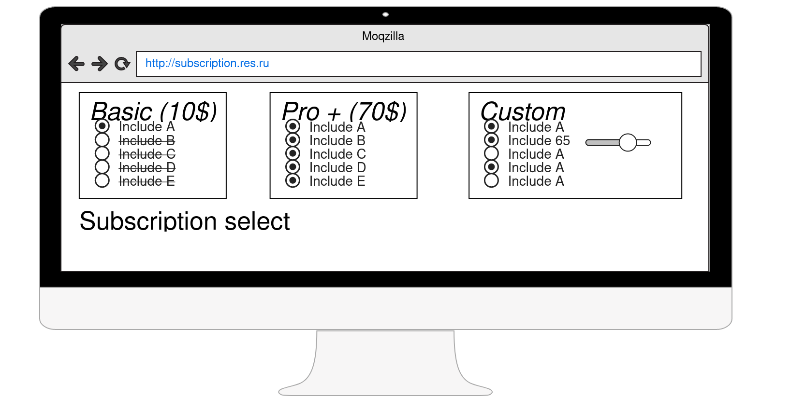
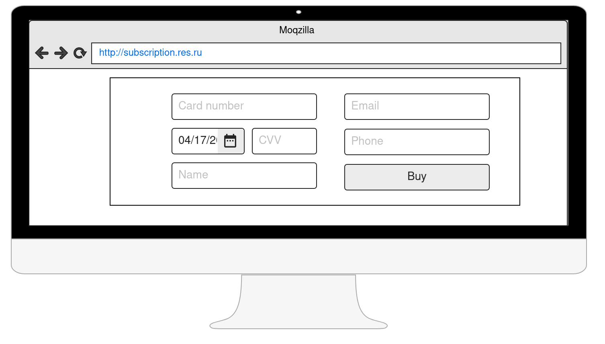

#Сервис оплаты подписок
Сервис дает возможность создать сущность “подписка”. Подписка может быть как преднастроенной, так и конфигурируемой.
Админ имеет возможность задавать какие возможности есть у подписки(название поля, тип поля) и настраивать базовые
варианты,
Пользователь же имеет возможность выбрать из преднастроенных подписок или сформировать свою.

